# 밀당 화면 감사 — API 성공 상태

검증 기준은 `api 명세서.md`의 화면 API 매핑, `밀당_와이어프레임_v2.html`, 현재 demo 빌드입니다. Microsoft Edge/Playwright에서 402×874 모바일 뷰포트로 성공 응답을 주입해 핵심 흐름을 직접 이동했습니다. 콘솔·페이지 오류는 없었습니다.

> **증거 범위:** 이 문서는 레이아웃 확인용 성공 응답 fixture로 만든 시각 감사입니다. §14 제출 빌드의 실제 동작 검증 결과가 아닙니다. 특히 이 캡처에 사용한 테스트 스크립트는 AI 분석·흥정·리포트도 고정 응답으로 대체했으므로, §14의 “AI 분석·흥정·리포트는 실제 동작” 충족 여부를 입증하지 않습니다. 애플리케이션 번들에는 이 테스트 스크립트가 포함되지 않습니다.

## 결론

API가 모두 성공해도 현재 제출 화면은 아직 완료 상태로 보기 어렵습니다. 직접 입력 분리 화면과 3a·3b·4b 연결은 정상이나, 컨디션 체크인 저장 불가, 밀당 대화 조작부 충돌, 완료 리포트 레이아웃 붕괴가 핵심 블로커입니다.

## 흐름별 상태

1. 로그인 — **주의**: 데모 안내가 로고 위에 겹칩니다.  
   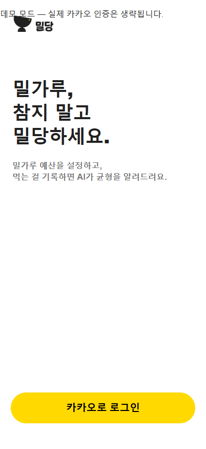

2. 기간 선택 — **주의**: API의 제목·설명은 표시되지만 `priceKrw`가 카드에 없고 긴 부제는 한 줄 말줄임됩니다.  
   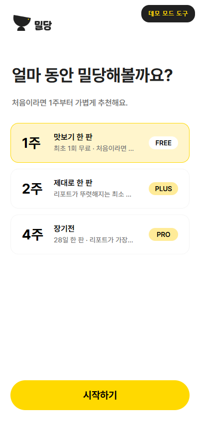

3. 2주 결제 — **문제**: 데모 결제 안내가 결제 카드 제목과 겹칩니다.  
   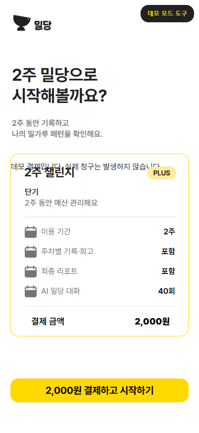

4. 식습관 — **양호**: 선택 상태와 CTA가 명확합니다. 다만 하단까지 큰 빈 공간이 남습니다.  
   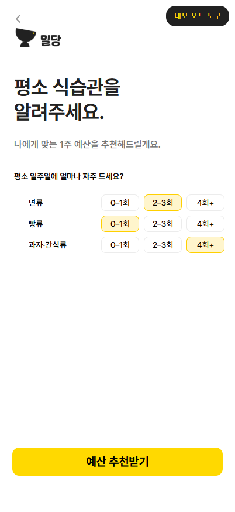

5. 예산 설정 — **문제**: 명세의 `anchors`, `options[].label`, `options[].note`를 사용하지 않고, 세 난이도 문구를 좁은 고정 카드에 배치합니다.  
   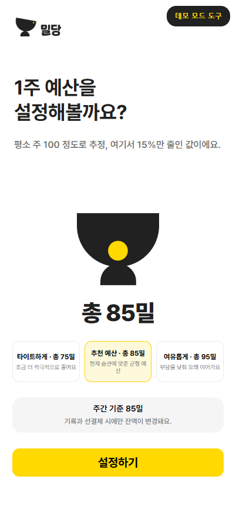

6. 메인보드 — **주의**: 잔액과 동선은 명확하지만 명세 예시의 정상 `tip.text`가 한 줄 고정 영역에서 오른쪽으로 잘립니다. 데모 도구도 시스템 상태 영역을 침범합니다.  
   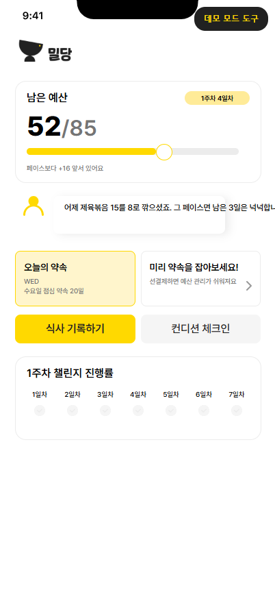

7. 식사 — **주의**: 기능은 연결되지만 자주 먹는 칩이 붙어 보이고 `PENDING`, `HIGH` 같은 서버 enum이 그대로 노출됩니다.  
   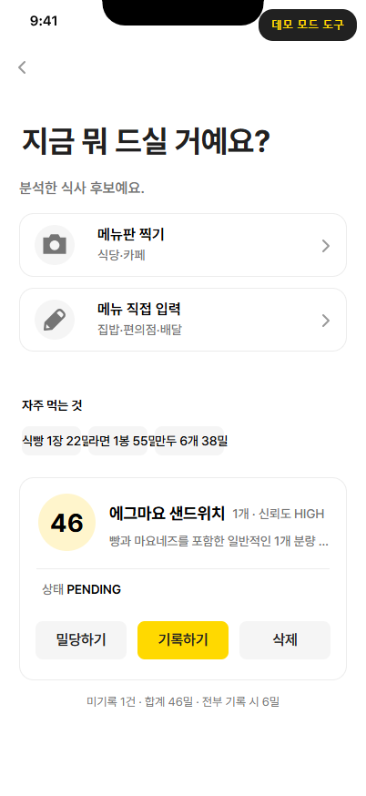

8. 3b → 직접 입력 — **양호**: 별도 스크린으로 열리고 식사 맥락이 유지됩니다.  
   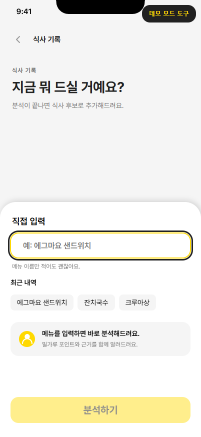

9. 스캔 결과 — **양호**: 추천, 기록, 밀당, 점수 수정, 직접 입력 진입이 보입니다.  
   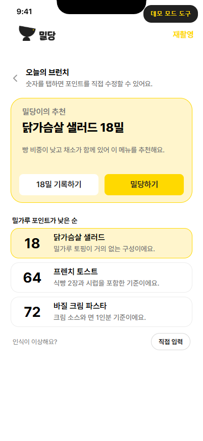

10. 4b → 직접 입력 — **양호**: 별도 스크린이며 `스캔 결과` 맥락이 유지됩니다.  
    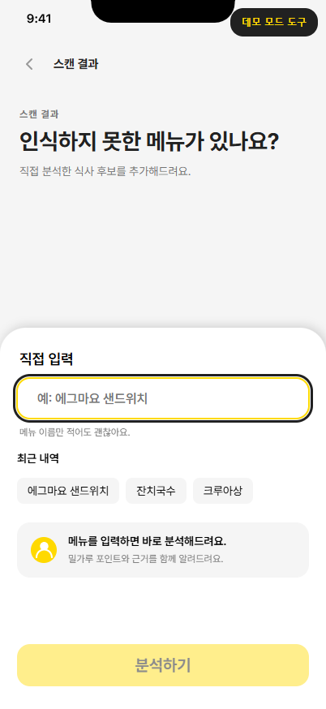

11. 밀당 대화 — **블로커**: `나가기` 버튼이 로고 밑에 겹쳐 일반 클릭이 차단됐고, `보내기`가 기본 HTML 버튼으로 하단 추천 답변 영역과 충돌합니다.  
    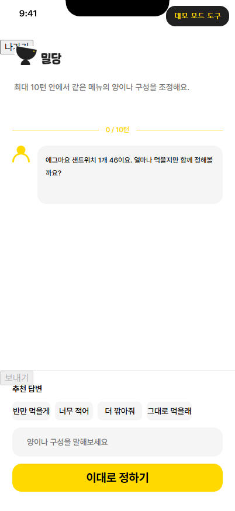

12. 약속 사전 결제 — **문제**: 요일이 작은 브라우저 기본 셀렉트로 노출되고, 메뉴명·단위·포인트가 겹칩니다. 상태 enum도 그대로 보입니다.  
    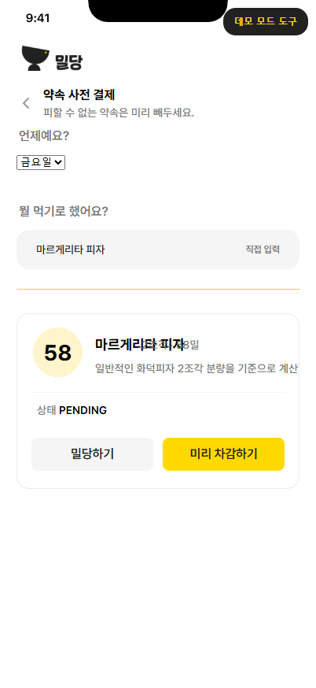

13. 3a → 직접 입력 — **양호**: 별도 스크린으로 열리고 약속 맥락이 유지됩니다.  
    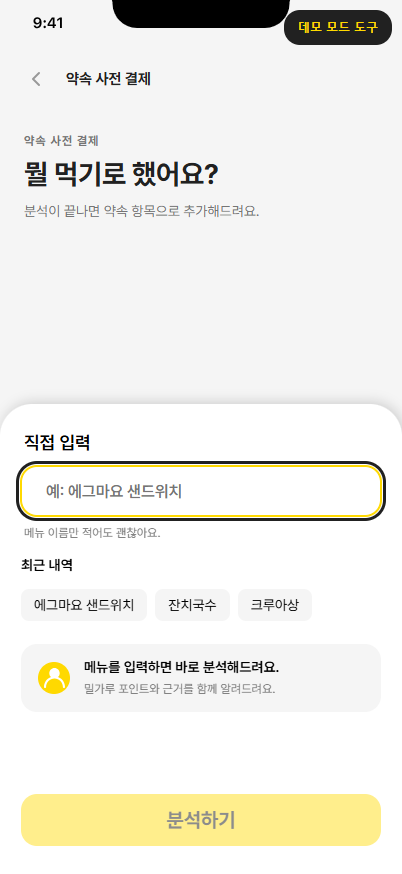

14. 컨디션 체크인 — **블로커**: 세 항목을 모두 선택해도 저장 CTA가 화면에 나타나지 않고 자동 저장도 실행되지 않습니다. 성공 API여도 `PUT /checkins/today`까지 갈 수 없습니다.  
    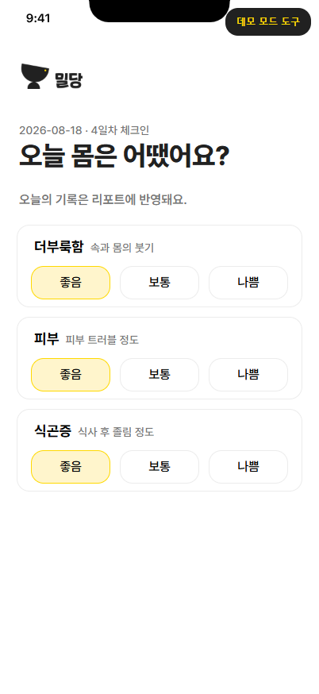

15. 완료 리포트 — **블로커**: 발견 문구·표본 안내·면책 문구가 카드 상단에 겹치고, `78/85`와 `예산 대비 −7`이 충돌합니다. API의 발견 상세, 흥정 하이라이트, 재대결 CTA도 화면 구조에 제대로 매핑되지 않습니다.  
    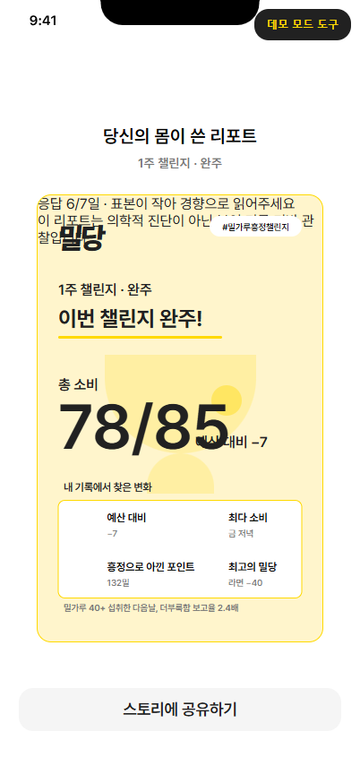

16. 데모 도구 열린 상태 — **문제**: 시나리오 적용 뒤 패널이 자동으로 닫히지 않아 리포트 제목과 상단 콘텐츠를 가립니다.  
    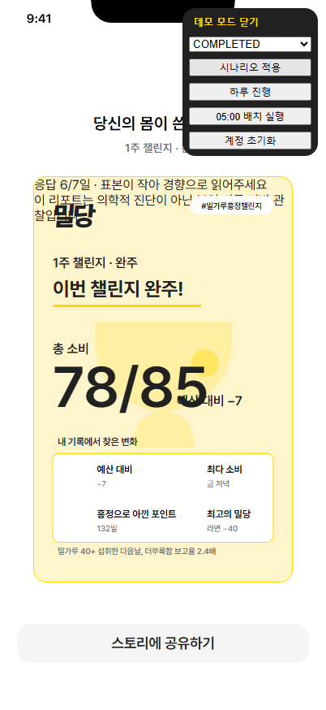

## 우선순위

### P0 — 제출 전 반드시 수정

- 체크인: 3개 선택 완료 시 자동 저장하거나 명시적인 `체크인 저장하기` CTA를 노출합니다.
- 밀당 대화: 헤더를 `닫기/브랜드/잔액` 구조로 다시 배치하고, 입력창 우측에 실제 전송 버튼을 스타일링합니다.
- 완료 리포트: API 필드를 와이어프레임의 `상단 3개 지표 → 발견 카드 → 흥정 하이라이트 → 공유/재대결` 구조에 다시 매핑합니다.

### P1 — 공모전 완성도에 큰 영향

- DemoControls를 safe area 아래의 작은 플로팅 탭이나 개발자 드로어로 이동하고, 명령 실행 후 자동으로 접습니다.
- 결제·로그인 데모 안내를 정상 문서 흐름이 아닌 전용 배너 영역에 배치합니다.
- 약속 화면의 요일 선택을 와이어프레임의 7개 요일 세그먼트로 복원하고 카드 내 텍스트 충돌을 제거합니다.
- 예산 화면 설명에 줄바꿈을 허용하고 난이도 선택을 세로 카드 또는 짧은 라벨로 정리합니다.

### P2 — 마감 polish

- `PENDING`, `HIGH`를 `기록 전`, `신뢰도 높음`처럼 현지화합니다.
- 자주 먹는 칩 간격과 가로 스크롤/줄바꿈 규칙을 정리합니다.
- 데모 도구와 모든 상단 버튼의 최소 터치 영역 및 포커스 표시를 다시 확인합니다.

## 접근성 확인 범위

역할·이름 기반으로 주요 버튼과 라디오 그룹을 조작했고, 핵심 이동 가능 여부를 확인했습니다. 다만 전체 키보드 순서, 스크린리더 낭독, 색 대비 수치까지 포함한 완전한 접근성 감사는 아닙니다.
